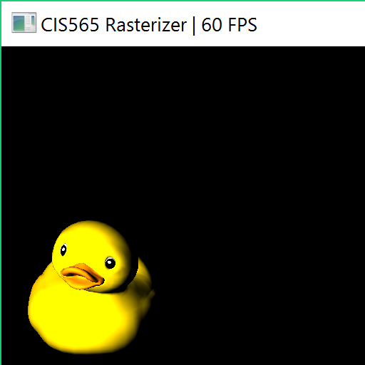
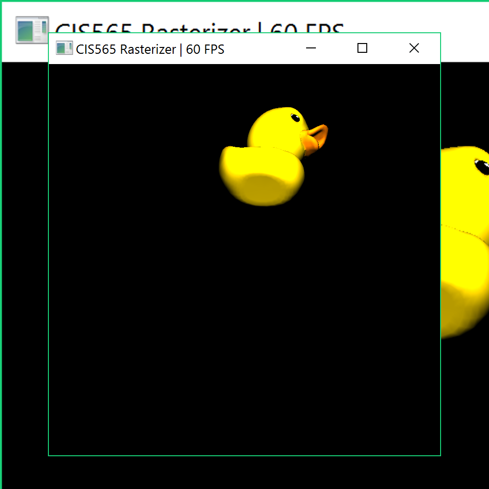

CUDA Rasterizer
===============

[CLICK ME FOR INSTRUCTION OF THIS PROJECT](./INSTRUCTION.md)

**University of Pennsylvania, CIS 565: GPU Programming and Architecture, Project 4**

* Anton Khabbaz pennKey akhabbaz@ceas.upenn.edu
* Tested on: windows Surface book with a 965M Nvidia Card

### (TODO: Your README)

images:

This project was to write a rasterizer from scratch. I first got the triangle to work. Getting an image at all was quite a challenge.

I colored that red.  The main step there was to transform the triangle into eye coordinates and then create a bounding box for it.  Once I would only rasterize when a pixel was included in the bounding box.  With a white color that worked.

Thereafter I tried the duck and the box.  Both produced white images that rotated with the cursor.  To get this to work, I found that I needed to read about the gltf format to interpret the data.

Next I worked on textures and I used the duck as a basis.  At first I was not reading the UV coordinates correctly and that prevented me from getting any UV coordinates.  With some help I found that bug.  Next I was getting some striped duct where the color was blue black and white.  The error there was that I was multiplying the float by both the number of pixels in width and by the bytes per pixel and then I was truncating the integer.  What worked was multiplying by the width only, getting an int, and then counting corrrectly to get the proper bytes.  An issue was according to the gltf file that png file should be rgba but instead it was rgb.

With some scaling that worked.

Next I made sure to average the UV using interpolated Barycentric coordinates.  My code first uses Pixel Barycentric coordinates and those computed by the rasterize.cu renderTools correctly depend only on the pixel x, and y (not pixelz).  By multiplying by the pixelz one can get interpolation correct coordinates. Equivalently one can divide by the Eye coordinate Z. My code interpolates attributes correctly for eye space coordinates.  One needs only the pixel Barycentric coordinates and the z values of the three vertices and the point in question.

I also correctly got the depth using atomicCAS() to resolve data races.  I used the code in the notes.  I first computed the fragment color, world space normal, and world space position and update a temporary fragment.  I then used the depth buffer. For comparing depths, I cast a pointer to an int into a pointer to a float. As floats the depth buffer could be compared for depth. Only for fragments that are close enough was an attempt made to write.  As ints, atomicCASlets us know if there is a race to write to that pixel.  The loser of that race needs to wait until the old value was written and then potentially writing to the depth buffer and fragment. The loser of the race may still write its fragment to the buffer but it will start well after the winner began writing so in this way there is no race.

I wrote the shader too.  It takes two lights and calculates Lambertian reflection using the light direction and the normal.  The images look good in that real shadows can be seen as with the duck. 

I rarely see the depth buffer drawing fragments that should be culled. The perspective with the milk truck appears to distort but I think that may have to do with the supplied transformation matrices.  Also the program crashes with some moves especially when the obect is close to the front of the screen.

After first submitting this I replaced the atomic cas code and used a mutex. That waits until there are not two reads of the same fragment, and then updates the fragment buffer. In this image you can see that the underside of the milktruck renders properly.  The windows are red and that is because there is no texture for them in open GL. Aside from that problem, I think that the atomicCAS is working. 

Other things that are working are that when one pans or zooms the MilkTruck stays in perspective.

I was not able to figure out why the image distorts so much.
 

### Credits

* [tinygltfloader](https://github.com/syoyo/tinygltfloader) by [@soyoyo](https://github.com/syoyo)
* [glTF Sample Models](https://github.com/KhronosGroup/glTF/blob/master/sampleModels/README.md)
